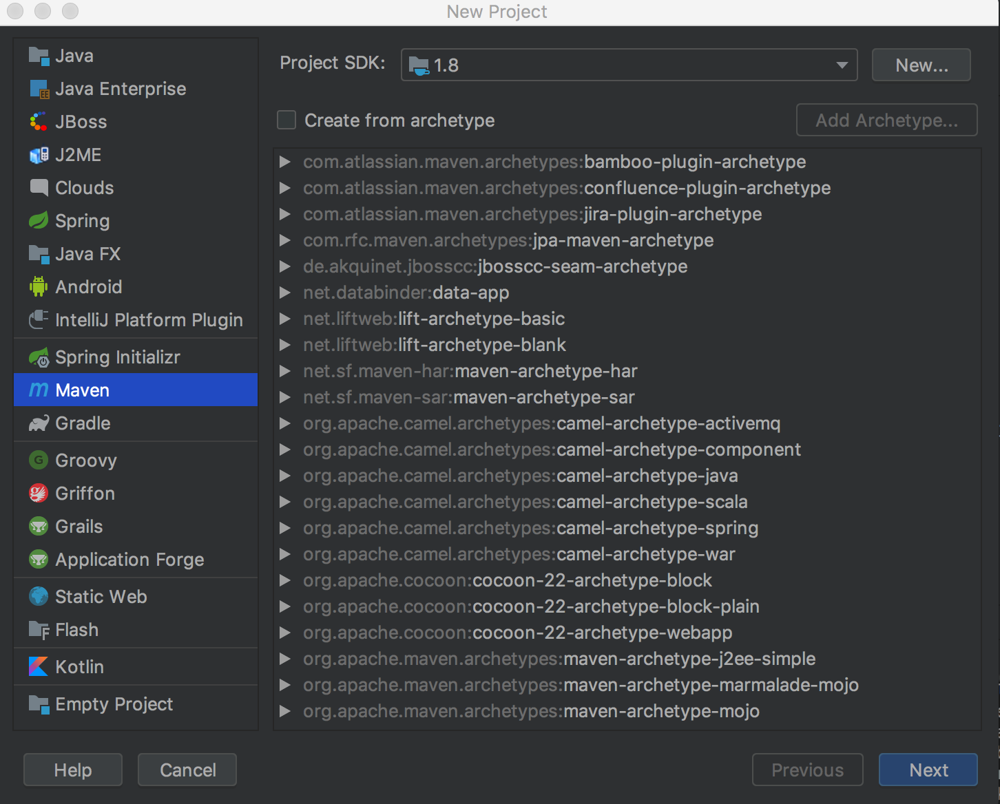
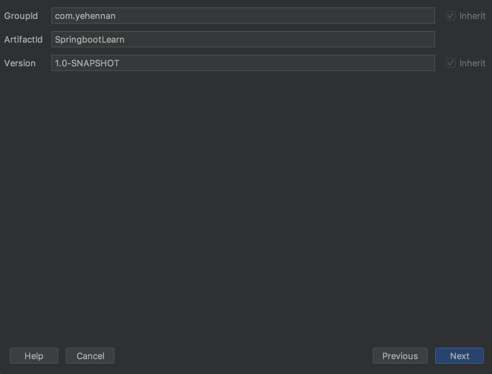
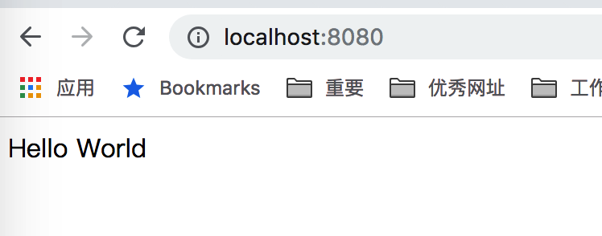
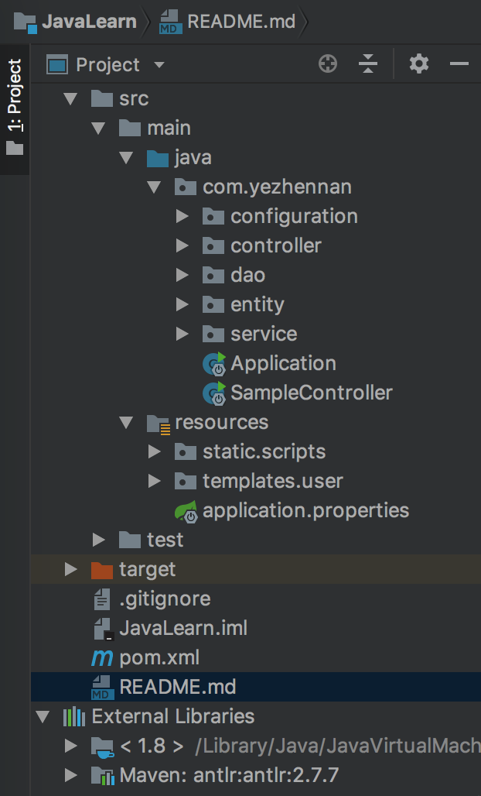
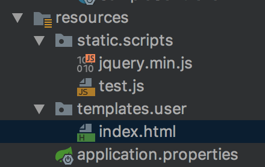

Java后端学习
----------------
java技术栈：[技术栈](https://www.cnblogs.com/thingk/p/6813045.html)   
[思维导图](https://www.cnblogs.com/JAYIT/p/8656846.html)   
[详细学习文章](https://my.oschina.net/javaroad/blog/1793570)

一. 环境搭建    
    a. IDE：IntelliJ IDEA
    > 进入官网下载安装，[下载地址](http://www.jetbrains.com/idea/)   
     [破解注册码](http://www.jetbrains.com/idea/)
    
    b. Java 1.8 以上版本（官方推荐）
    > Java安装自行百度，切记配置**环境变量**
    
二. Spring boot框架学习（公司项目是基于Spring boot基础框架进行开发的）  
1. 新建项目，选择Maven项目，配置Java SDK，选择下一步。


2. 填写包名，以及项目名称，选择下一步。


3. 空项目目录结构。


其中pom.xml文件是整个项目用于包依赖管理配置文件。

```javascript
<project xmlns="http://maven.apache.org/POM/4.0.0" xmlns:xsi="http://www.w3.org/2001/XMLSchema-instance"
         xsi:schemaLocation="http://maven.apache.org/POM/4.0.0 http://maven.apache.org/xsd/maven-4.0.0.xsd">
    <modelVersion>4.0.0</modelVersion>

    <groupId>com.system</groupId>
    <artifactId>JavaLearn</artifactId>
    <version>1.0-SNAPSHOT</version>

    <name>JavaLearn</name>
    <!-- FIXME change it to the project's website -->
    <url>http://www.example.com</url>

    <properties>
        <project.build.sourceEncoding>UTF-8</project.build.sourceEncoding>
        <maven.compiler.source>1.7</maven.compiler.source>
        <maven.compiler.target>1.7</maven.compiler.target>
    </properties>

    <parent>
        <groupId>org.springframework.boot</groupId>
        <artifactId>spring-boot-starter-parent</artifactId>
        <version>1.5.1.RELEASE</version>
    </parent>

    <dependencies>
        <dependency>
            <groupId>junit</groupId>
            <artifactId>junit</artifactId>
            <version>4.11</version>
            <scope>test</scope>
        </dependency>
        <dependency>
            <groupId>org.springframework.boot</groupId>
            <artifactId>spring-boot-starter-web</artifactId>
        </dependency>
        <!-- https://mvnrepository.com/artifact/mysql/mysql-connector-java -->
        <dependency>
            <groupId>mysql</groupId>
            <artifactId>mysql-connector-java</artifactId>
            <version>5.1.39</version>
        </dependency>
        <!-- https://mvnrepository.com/artifact/org.springframework.boot/spring-boot-starter-thymeleaf -->
        <dependency>
            <groupId>org.springframework.boot</groupId>
            <artifactId>spring-boot-starter-thymeleaf</artifactId>
            <version>1.4.0.RELEASE</version>
        </dependency>
        <!-- https://mvnrepository.com/artifact/org.springframework.data/spring-data-jpa -->
        <dependency>
            <groupId>org.springframework.boot</groupId>
            <artifactId>spring-boot-starter-data-jpa</artifactId>
            <version>1.5.1.RELEASE</version>
        </dependency>
    </dependencies>

    <build>
        <pluginManagement><!-- lock down plugins versions to avoid using Maven defaults (may be moved to parent pom) -->
            <plugins>
                <plugin>
                    <artifactId>maven-clean-plugin</artifactId>
                    <version>3.0.0</version>
                </plugin>
                <!-- see http://maven.apache.org/ref/current/maven-core/default-bindings.html#Plugin_bindings_for_jar_packaging -->
                <plugin>
                    <artifactId>maven-resources-plugin</artifactId>
                    <version>3.0.2</version>
                </plugin>
                <plugin>
                    <artifactId>maven-compiler-plugin</artifactId>
                    <version>3.7.0</version>
                </plugin>
                <plugin>
                    <artifactId>maven-surefire-plugin</artifactId>
                    <version>2.20.1</version>
                </plugin>
                <plugin>
                    <artifactId>maven-jar-plugin</artifactId>
                    <version>3.0.2</version>
                </plugin>
                <plugin>
                    <artifactId>maven-install-plugin</artifactId>
                    <version>2.5.2</version>
                </plugin>
                <plugin>
                    <artifactId>maven-deploy-plugin</artifactId>
                    <version>2.8.2</version>
                </plugin>
            </plugins>
        </pluginManagement>
    </build>
</project>

```

(1) 引入Spring boot 
打开pom.xml文件，设置spring-boot-starter-parent为父亲项目，这种方式可以比较容易的使用父项目中的starters的依赖。 当然也可以不用继承spring-boot-starter-parent为父亲。
```javascript
<parent>
    <groupId>org.springframework.boot</groupId>
    <artifactId>spring-boot-starter-parent</artifactId>
    <version>1.5.1.RELEASE</version>
</parent>
```
引入web依赖，Web starter依赖引入，会增加web容器、springweb、springmvc、jackson-databind等相关的依赖。
```javascript
<dependency>
    <groupId>org.springframework.boot</groupId>
    <artifactId>spring-boot-starter-web</artifactId>
</dependency>
```
(2) 增加Hello world示例程序类SampleController。
```javascript
@Controller
@EnableAutoConfiguration
public class SampleController {

    @RequestMapping("/")
    @ResponseBody
    String home() {
        return "Hello World";
    }

    public static void main(String[] args) throws Exception {
        SpringApplication.run(SampleController.class, args);
    }
}
```
其中，@Controller和@EnableAutoConfiguration为框架提供的注解。并且类提供了main方法以及返回"hello world"字样的方法。紧接着，直接运行SampleController类。访问http://localhost:8080/就可以访问这个controller的功能了。访问效果如下：


至此，就是最简单的hello world程序。

三. 构建小而全的完整web项目    
(1) 一睹完整的包目录结构

其实这些也是官方推荐的目录结构，采用包分层结构，让项目结构更清晰。    
**configuration：** 项目自身代码级别的配置文件目录。  
**controller：** 前端代码控制层。  
**dao：** 数据访问层一般也可以写作**repository**。   
**entity：** 数据实体。    
**service：** 业务逻辑层。    
**Application：** 程序启动入口。    

resources项目资源存放目录   
其中**application.properties**为项目开发属性配置文件。  

(2) 添加主程序入口类Application  
```javascript
/**
 * 项目启动入口，配置包根路径
 */
@SpringBootApplication
public class Application {
    public static void main(String[] args) throws Exception {
        SpringApplication.run(Application.class, args);
    }
}
```
(3) 创建一个用户实体类User
```javascript
@Entity
@Table(name = "tbl_user")
public class User {

    @Id
    @GeneratedValue(strategy = GenerationType.IDENTITY)
    private long id;

    private String name;

    private String password;

    public long getId() {
        return id;
    }

    public void setId(long id) {
        this.id = id;
    }

    public String getName() {
        return name;
    }

    public void setName(String name) {
        this.name = name;
    }

    public String getPassword() {
        return password;
    }

    public void setPassword(String password) {
        this.password = password;
    }
}
```
(4) 创建数据访问类UserRepositoty  
```javascript
@Repository
public interface UserRepositoty extends JpaRepository<User, Long> {

    @Query("select t from User t where t.name = :name")
    User findByUserName(@Param("name") String name);
}
```
注意这里继承的类为JpaRepository，需要引入相应的框架。
```javascript
<dependency>
    <groupId>org.springframework.boot</groupId>
    <artifactId>spring-boot-starter-data-jpa</artifactId>
    <version>1.5.1.RELEASE</version>
</dependency>
```
添加JpaConfiguration配置类。
```javascript
@Order(Ordered.HIGHEST_PRECEDENCE)
@Configuration
@EnableTransactionManagement(proxyTargetClass = true)
@EnableJpaRepositories(basePackages = "com.system.dao")
@EntityScan(basePackages = "com.system.entity")
public class JpaConfiguration {
    @Bean
    PersistenceExceptionTranslationPostProcessor persistenceExceptionTranslationPostProcessor() {
        return new PersistenceExceptionTranslationPostProcessor();
    }
}
```
UserRepositoty类中通过方法findByUserName获取一个用户实体，利用注解@Query申明了查询数据库的语句。
因此这个时候本机需要安装数据库软件，我的mac安装的是MySql，此处省略MySql的安装以及使用，请自行百度。

现在需要在**application.properties**文件中为项目配置相应的信息。  
```javascript
#MySQL
spring.datasource.driver-class-name=com.mysql.jdbc.Driver
spring.datasource.url=jdbc:mysql://localhost:3306/test?characterEncoding=utf8
spring.datasource.username=root
spring.datasource.password=root
#Spring Data JPA
spring.jpa.database=MYSQL
spring.jpa.show-sql=true
spring.jpa.hibernate.ddl-auto=update
# Naming strategy
spring.jpa.hibernate.naming-strategy=org.hibernate.cfg.ImprovedNamingStrategy
# stripped before adding them to the entity manager)
spring.jpa.properties.hibernate.dialect=org.hibernate.dialect.MySQL5Dialect
```
**spring.datasource.url**这里申明了所使用的数据库为test，这里有个坑，首先需要确保本地已经创建了test数据库，并且本地数据库服务启动运行。**spring.datasource.username、spring.datasource.password**申明了访问数据库的账户和密码，这个也需要正确。

打开**pom.xml**文件，导入Jpa以及MySql。
```javascript
<dependency>
    <groupId>mysql</groupId>
    <artifactId>mysql-connector-java</artifactId>
    <version>5.1.39</version>
</dependency>

<dependency>
    <groupId>org.springframework.boot</groupId>
    <artifactId>spring-boot-starter-data-jpa</artifactId>
    <version>1.5.1.RELEASE</version>
</dependency>
```
(5) 创建业务逻辑层代码UserService。
```javascript
@Service
public class UserService {
    @Autowired
    private UserRepositoty userRepositoty;

    public User findUserByName(String name) {
        User user = null;
        try {
            user = userRepositoty.findByUserName(name);
        } catch (Exception e) {
        }
        return user;
    }
}
```
方法很简单，入参通过名字获得一个用户信息。
(6) 最后创建提供给前端使用的接口api，创建UserController类。
```javascript
@RequestMapping("/user")
public class UserController {
    @Autowired
    private UserService userService;

    @RequestMapping(value = "/index", method = RequestMethod.GET)
    public String index() {
        return "user/index";
    }


    @RequestMapping(value = "/show", method = RequestMethod.GET)
    @ResponseBody
    public String show(@RequestParam(value = "name") String name) {
        User user = userService.findUserByName(name);
        if (null != user)
            return user.getId() + "/" + user.getName() + "/" + user.getPassword();
        else return "null";
    }
}
```
此类提供了两个方法，index方法返回了一个路径。show方法返回拼接后的用户信息。
最后在resources下面添加一个测试页面。内容如下图： 

打开**application.properties**文件，添加配置信息。
```javascript
#视图层控制
spring.mvc.view.prefix=classpath:/templates/
spring.mvc.view.suffix=.html
spring.mvc.static-path-pattern=/static/**
```

OK，一切准备就绪，剩下的就是启动Application了。
