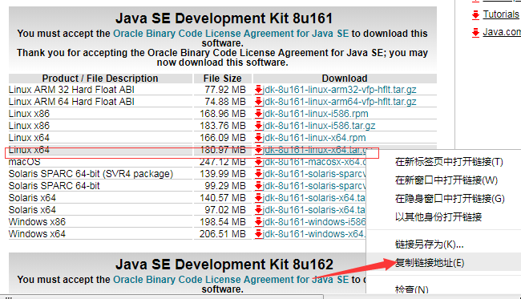

阿里云服务器学习之旅
------------
### 1. 登入阿里云官网购买ECS实例
实例配置信息：   
CPU： 2核  
内存： 4 GB   
实例类型： I/O优化   
操作系统： CentOS 7.4 64位     


### 2. Mac连接ECS实例
打开终端    
```bash
$ ssh root@阿里云公网IP
Are you sure you want to continue connecting (yes/no)? 
$ yes
```
然后输入密码，就可以正常登入了。

### 3. 安装jdk
(1) wget命令下载方式  
复制安装包下载路径：
   
执行wget命令：  
```bash
wget --no-cookies --header "Cookie: oraclelicense=accept-securebackup-cookie;" https://download.oracle.com/otn-pub/java/jdk/8u202-b08/1961070e4c9b4e26a04e7f5a083f551e/jdk-8u202-linux-x64.tar.gz
```   
(2) 解压  
切换到安装包保存目录，解压到指定目录：   
```bash
tar -zxvf jdk-8u202-linux-x64.tar.gz -C /usr/local/
```      
(3) 配置环境变量   
打开系统环境变量配置文件：   
```bash
vim /etc/profile
```   
在profile文件末尾加上如下内容：   
```bash
## JAVA
JAVA_HOME=/usr/local/jdk1.8.0_202
JRE_HOME=/usr/local/jdk1.8.0_202/jre
PATH=$PATH:$JAVA_HOME/bin:$JRE_HOME/bin
CLASSPATH=.:$JAVA_HOME/lib/dt.jar:$JAVA_HOME/lib/tools.jar:$JRE_HOME/lib
export JAVA_HOME JRE_HOME PATH CLASSPATH
```    
按esc之后输入的是 :q 和 :wq ，这两个都可以保存退出vim操作。   
(4) 配置文件生效   
为了使得配置文件立即生效，执行如下命令   
```bash
source /etc/profile
```    
(5) 检测java环境  
```bash
java -version
```